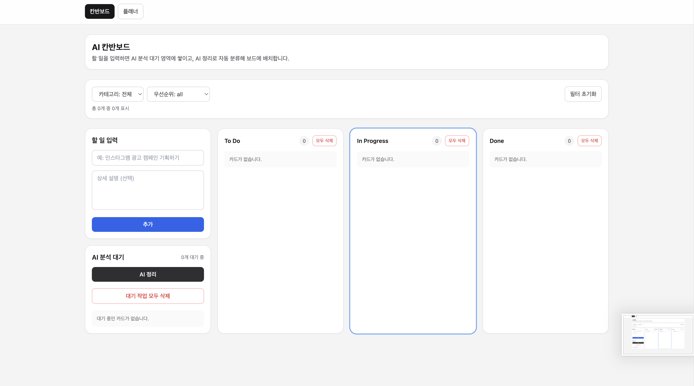
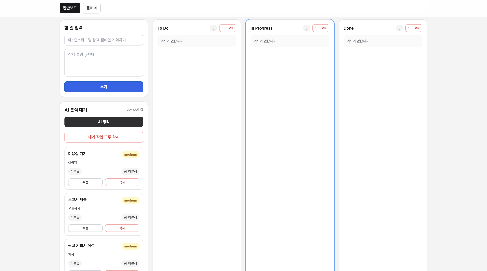
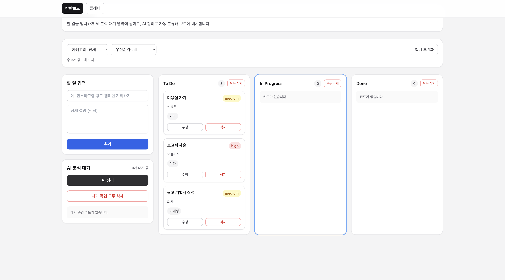
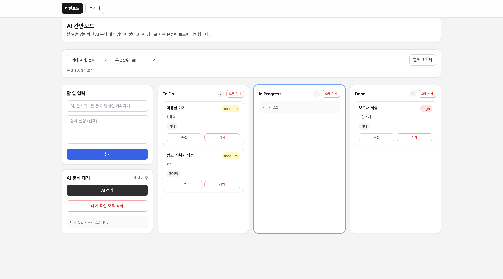
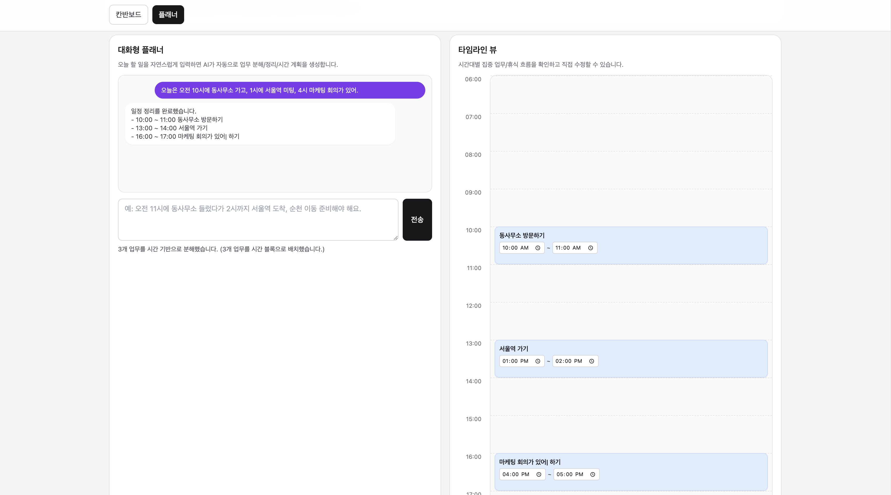
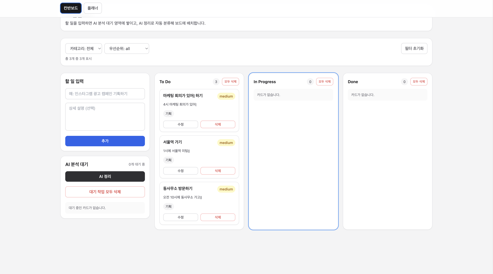

# AI Kanban System

> Task management system with AI-assisted organization and Kanban workflow

---

## Overview
AI Kanban System is a task management application that combines a traditional Kanban board with AI-powered task organization.

Users can create tasks freely and then use AI to automatically categorize, prioritize, and place them into appropriate workflow stages.

---

## Features

### Task Management
- Create, update, and delete tasks
- Move tasks across workflow columns (To Do / In Progress / Done)
- Edit task fields: title, description, category, priority
- Schedule updates supported for timeline-linked tasks

### AI Organization
- "AI Organize" runs batch analysis for pending (unanalyzed) tasks
- Automatically assigns:
  - Category
  - Priority (`high` / `medium` / `low`)
  - Status (`todo` / `in_progress` / `done`)
- Unanalyzed tasks are separated and processed first
- Fallback local classification/scheduling is applied when Gemini is unavailable or rate-limited

### Demo

<p align="center">
  
  
</p>

<p align="center">
  
  
</p>

<p align="center">
  
  
</p>

### Kanban Board
- 3-column workflow:
  - To Do
  - In Progress
  - Done
- Status-based grouping and counts
- Column-level task deletion support

### Interactive Planner (Chat + Timeline)
- Natural-language planner input (Korean text supported)
- AI-assisted task splitting and time-block scheduling
- Timeline view with drag-to-reschedule interactions
- Existing schedule is considered to avoid overlap where possible

### UX Enhancements
- Pending section with "AI 미분석" state
- Loading feedback during AI processing
- Error messages with graceful fallback behavior
- Visual feedback while dragging tasks

## Tech Stack

- Frontend: React 19 + TypeScript
- Build Tooling: Create React App (`react-scripts`)
- Styling: Tailwind CSS (+ PostCSS, Autoprefixer)
- State Management: React Hooks (`useState`, `useMemo`, custom hooks)
- Data Layer: Firebase Firestore
- AI Integration: Gemini API via local proxy endpoint (`setupProxy.js`)
- Drag & Drop: Native HTML5 Drag and Drop (no external DnD library)

---

## Architecture

```txt
src/
  config/
    app_env.ts
    firebase_config.ts
    firebase_client.ts
  features/
    board/
      components/
        task_input.tsx
        pending_task_list.tsx
        board_column.tsx
        task_card.tsx
        timeline_view.tsx
        delete_task_modal.tsx
        planner_chat_panel.tsx
      hooks/
        use_board_tasks.ts
        use_ai_organize.ts
      services/
        task_service.ts
        ai_service.ts
      types/
        task_types.ts
      constants/
        board_constants.ts
      board_page.tsx
    planner/
      planner_page.tsx
  App.tsx
  index.tsx
  setupProxy.js
